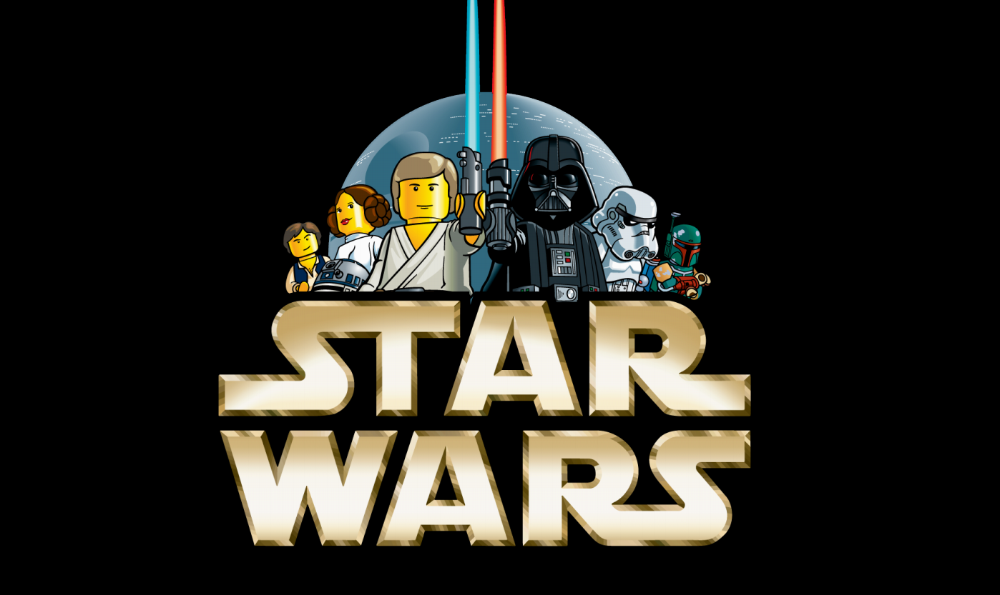
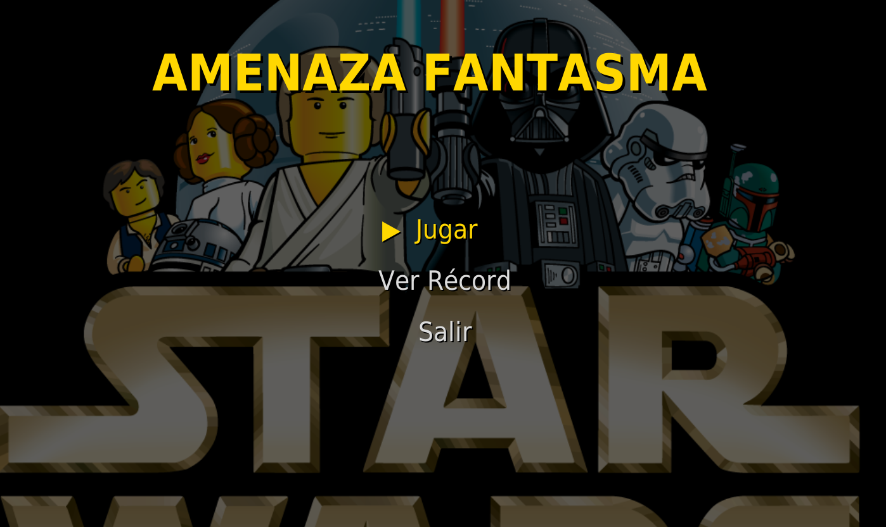
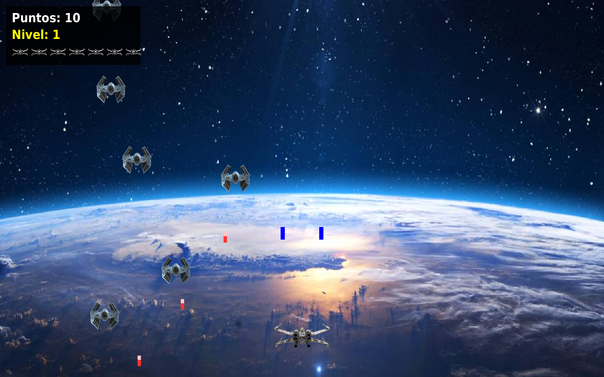
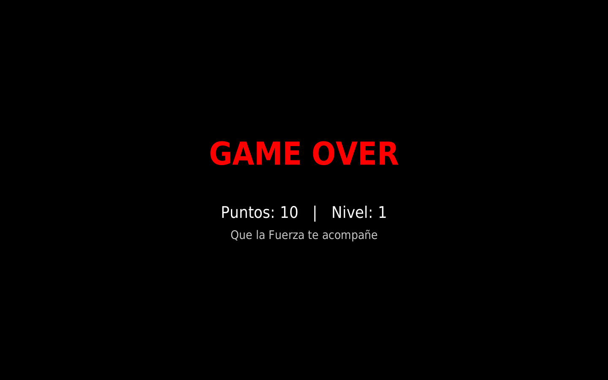
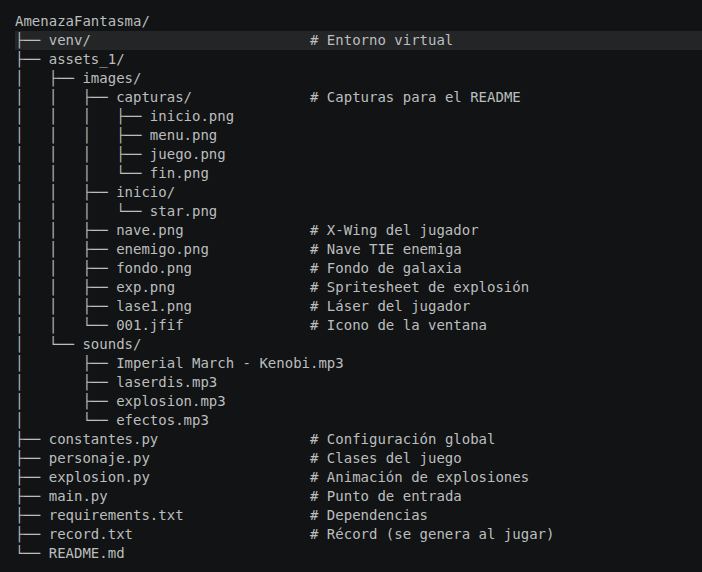
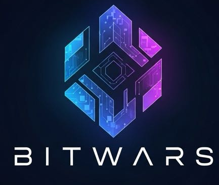

# 🚀 Amenaza Fantasma

Videojuego arcade desarrollado en **Python + Pygame** como proyecto de la **Tecnicatura Superior en Programación** — UTN San Rafael, Mendoza.

Un tributo interactivo a Star Wars: controlás una X-Wing, disparás desde sus cañones laterales y destruís naves TIE enemigas que atacan en zig-zag mientras esquivás una lluvia de láseres.

---

## 📸 Capturas de pantalla

### 🎬 Pantalla de inicio
> La Marcha Imperial suena mientras se muestra la presentación.



### 🏠 Menú principal
> Opciones: Jugar, Ver Récord y Salir.



### 🎮 En pleno juego
> La X-Wing disparando, naves TIE atacando en zig-zag y el HUD con puntaje, nivel y vidas.



### 💀 Game Over
> Al perder toda la energía, se muestra el puntaje final y se guarda el récord.



---

## 🕹️ Controles

| Tecla | Acción |
|-------|--------|
| ← ↑ → ↓ / W A S D | Mover la nave |
| Espacio | Disparar desde los 2 cañones |
| ESC | Salir al menú |

---

## ✨ Características

- 🧱 **Programación Orientada a Objetos**: clases `Personaje`, `Enemigo`, `Laser`, `LaserEnemigo`, `Explosion`
- 📦 **Arquitectura modular**: `constantes.py`, `personaje.py`, `explosion.py`, `main.py`
- 🏠 **Menú principal** con opciones: Jugar / Ver Récord / Salir
- 📊 **Sistema de puntaje y niveles progresivos** (más dificultad cada 250 puntos)
- ❤️ **HUD con puntaje, nivel y vidas** (iconos de X-Wing)
- 💥 **Explosiones animadas** con spritesheet de 16 frames
- 🎵 **Efectos de sonido y música**: Marcha Imperial (solo en la intro), láser, explosiones y sonido de proximidad
- 🏆 **Récord persistente** guardado en `record.txt`
- 🖥️ **Modo pantalla completa** adaptado a 1440×900
- 🛸 **Enemigos inteligentes**: se mueven en zig-zag, disparan y hacen sonar una alarma al acercarse

---

## ⚙️ Requisitos

- **Python** 3.10 o superior
- **Pygame** 2.6.1
- Sistema operativo: Linux, Windows o macOS

---

## 🚀 Instalación y ejecución


# 1. Clonar el repositorio (o descomprimir el ZIP)
git clone <URL-del-repo>
cd AmenazaFantasma

# 2. Crear y activar el entorno virtual
python3 -m venv venv

source venv/bin/activate          # Linux / Mac

venv\Scripts\activate           # Windows

# 3. Instalar dependencias
pip install -r requirements.txt

# 4. Ejecutar el juego
python main.py
```

---

## 📁 Estructura del proyecto

```



---

## 🧠 Conceptos aplicados

- **Programación Orientada a Objetos (POO)**: cada entidad del juego es una clase con atributos y métodos.
- **Modularidad**: el código está dividido en archivos según su responsabilidad.
- **Encapsulamiento**: cada clase maneja sus propios datos y comportamientos.
- **Manejo de eventos**: bucle de eventos de Pygame para interactividad.
- **Detección de colisiones**: uso de `pygame.Rect` y `colliderect()`.
- **Animaciones**: spritesheets cortados en frames.
- **Persistencia**: lectura y escritura del récord en archivo de texto.
- **Manejo de audio**: canales reservados para evitar cortes.

---

## 👨‍💻 Autor




## Tecnicatura Superior en Programación — UTN San Rafael, Mendoza, 2026

---

## 🌌 "Que la Fuerza te acompañe"