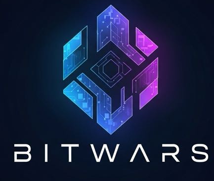
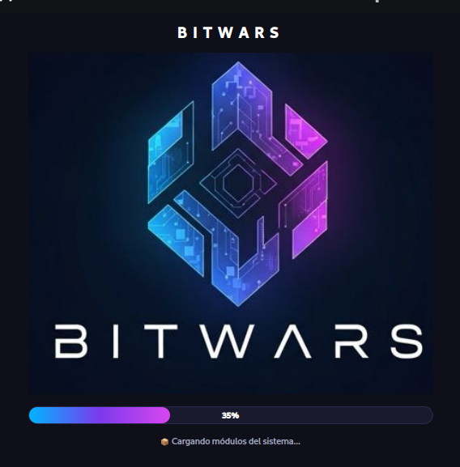
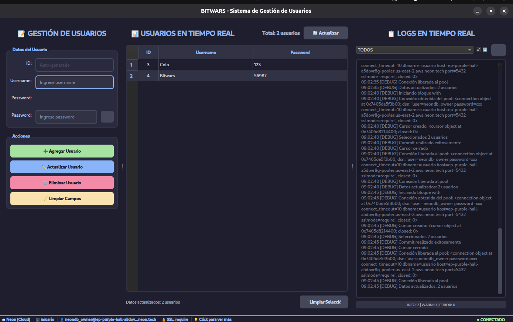
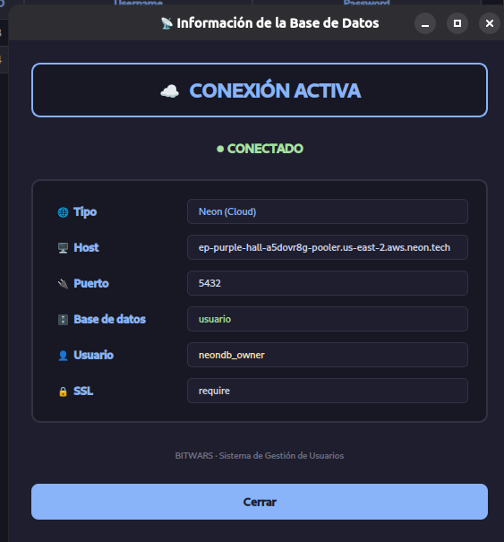
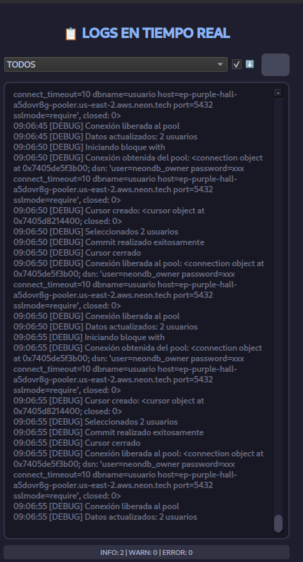

<div align="center">
  
  
  # PROYECTO BITWARS - PYTHON
  
  **CRUD de Usuarios con PostgreSQL (Neon) y PyQt6**
  
  
  
  
  
  
  
  
  
  
</div>

---

## 📖 Sobre el Proyecto

Módulo desarrollado en **Python** como parte del proyecto integrador **Bitwars**, correspondiente al **Cuarto Semestre de 2026** en la **Universidad Tecnológica Nacional (UTN) - Facultad Regional San Rafael, Mendoza**.

Esta sección implementa un **sistema CRUD (Create, Read, Update, Delete) de usuarios** con una interfaz gráfica moderna, conectado a una base de datos **PostgreSQL alojada en Neon (cloud)**.

## ✨ Características Principales

- 🎨 **Interfaz gráfica moderna** con PyQt6 (tema oscuro personalizado).
- 🚀 **Splash screen animado** con barra de progreso de 12 segundos.
- ☁️ **Base de datos en la nube** (Neon - PostgreSQL serverless).
- 🔌 **Pool de conexiones** reutilizables para mejor rendimiento.
- 🔄 **Context Manager** (`CursorDelPool`) para manejo automático de transacciones.
- 📊 **Logs en tiempo real** integrados en la interfaz.
- 🌐 **Información de conexión** visible desde la propia app.
- 🔒 **Credenciales seguras** mediante variables de entorno (`.env`).

## 🏫 Información Institucional

- **Universidad:** Universidad Tecnológica Nacional (UTN)
- **Facultad:** Facultad Regional San Rafael
- **Provincia:** Mendoza, Argentina
- **Carrera:** Tecnicatura Universitaria en Programación
- **Año / Semestre:** Cuarto Semestre - 2026

## 👥 Integrantes del Grupo "Bitwars"

| Nombre y Apellido | Rol |
| :--- | :--- |
| **Tomás Vilche** | Desarrollo |
| **Franchesco Cornachione** | PODER |
| **Valentín Castillo** | Desarrollo |
| **Damián Ponce de León** | Desarrollo |
| **Pablo García** | Desarrollo |

## 📸 Capturas de Pantalla

### 🚀 Splash Screen (Presentación)

Pantalla de inicio animada con barra de progreso mientras se inicializan los módulos y se conecta a la base de datos.



### 🖥️ Pantalla Principal

Interfaz principal con gestión de usuarios, tabla en tiempo real y panel de logs integrado.



### 📋 Información de la Base de Datos

Panel que muestra los datos de conexión activa a Neon (host, puerto, base de datos, usuario y SSL).



### 📝 Logs de la Base de Datos

Registro en tiempo real de las operaciones realizadas contra la base de datos.



## ☁️ Base de Datos en Neon

La base de datos **NO es local**: está alojada en **[Neon](https://neon.tech/)**, un servicio de PostgreSQL serverless en la nube.

### ¿Qué implica esto?

- **Host remoto:** conexión a un dominio tipo `ep-xxxx-xxxx.us-east-2.aws.neon.tech`.
- **SSL obligatorio:** Neon exige conexiones cifradas (`sslmode=require`).
- **Sin instalación local:** no hace falta instalar PostgreSQL en tu máquina.
- **Credenciales seguras:** van en el archivo `.env` (nunca en el código).

### Conexión desde el código

La clase `Conexion` detecta automáticamente si el host es de Neon y lo reporta:

```python
if 'neon.tech' in cls._HOST:
    tipo = 'Neon (Cloud)'

Datos de conexión reales (sin credenciales):
Parámetro	Valor
Tipo	Neon (Cloud)
Host	ep-purple-hall-a5dovr8g-pooler.us-east-2.aws.neon.tech
Puerto	5432
Base de datos	usuario
Usuario	neondb_owner
SSL	require
📂 Estructura del Proyecto
text

python/
│
├── main.py                    --> Punto de entrada (splash + app)
├── conexion.py                --> Pool de conexiones (Singleton) a Neon
├── cursor_del_pool.py         --> Context Manager para cursor/conexión
├── menu_app_usuario.py        --> Clase de menú (según UML)
├── usuario.py                 --> Entidad Usuario
├── usuario_dao.py             --> Data Access Object (CRUD)
├── logger_base.py             --> Configuración del logger
├── requirements.txt           --> Dependencias del proyecto
├── .env                       --> Credenciales de Neon (NO subir)
├── .env.example               --> Plantilla de variables de entorno
│
├── gui/                       --> Componentes gráficos (PyQt6)
│   ├── ventana_principal.py   --> Ventana principal
│   └── splash_screen.py       --> Pantalla de inicio animada
│
├── assets/                    --> Recursos gráficos
│   └── bitwars.png            --> Logo del proyecto
│
├── img/                       --> Capturas para el README
│   ├── panin.png              --> Splash screen
│   ├── pantallaprin.png       --> Pantalla principal
│   ├── infodb.png             --> Info de la BD
│   └── log.png                --> Logs en tiempo real
│
└── README.md                  --> Este archivo

🛠️ Tecnologías Utilizadas
Tecnología	Uso
Python 3.10+	Lenguaje principal
Neon (PostgreSQL)	Base de datos serverless en la nube
psycopg2-binary	Driver de conexión a PostgreSQL
PyQt6	Interfaz gráfica de usuario (GUI)
python-dotenv	Carga de variables de entorno desde .env
⚙️ Instalación y Configuración
1. Clonar el repositorio
bash

git clone https://github.com/HotCode2025/Bitwars-Cuarto-Semestre.git
cd Bitwars-Cuarto-Semestre/python

2. Crear y activar un entorno virtual (recomendado)
bash

# Crear entorno virtual
python3 -m venv venv

# Activar (Linux / macOS)
source venv/bin/activate

# Activar (Windows)
venv\Scripts\activate

3. Instalar dependencias
bash

pip install -r requirements.txt

4. Configurar las credenciales de Neon

Crear un archivo .env en la raíz del proyecto con las credenciales que te da Neon:
env

DB_NAME=usuario
DB_USER=neondb_owner
DB_PASSWORD=tu_password_neon
DB_PORT=5432
DB_HOST=ep-purple-hall-a5dovr8g-pooler.us-east-2.aws.neon.tech
DB_SSLMODE=require

    ⚠️ Importante: El archivo .env contiene credenciales sensibles. Nunca debe subirse al repositorio. Asegurate de que esté incluido en el .gitignore.

5. Obtener las credenciales desde Neon

    Ingresá al panel de Neon Console.

    Seleccioná tu proyecto.

    En Connection Details copiá los datos: Host, Database, User y Password.

    Pegalos en el archivo .env.

🚀 Ejecución
bash

python main.py

Al ejecutarlo, verás la splash screen animada (12 segundos) que:

    🚀 Inicializa la aplicación (0% → 15%)

    📦 Carga los módulos (15% → 35%)

    🔌 Conecta a PostgreSQL en Neon (35% → 55%)

    ✅ Confirma la conexión a la BD (55% → 75%)

    🎨 Construye la interfaz gráfica (75% → 90%)

    🎉 Muestra el sistema listo (90% → 100%)

Si la conexión falla, se muestra un mensaje de error y la aplicación se cierra.
🏗️ Arquitectura del Código
🎬 main.py — Punto de Entrada

Orquesta el inicio de la aplicación con una splash screen animada dividida en 6 fases. Durante la fase 3, verifica la conexión a la base de datos en Neon en paralelo con la animación.


🔌 conexion.py — Pool de Conexiones (Singleton)

Clase Conexion que administra un pool de conexiones reutilizables a PostgreSQL en Neon. Las credenciales se leen desde el archivo .env.
Método	Descripción
obtenerPool()	Crea o devuelve el pool (patrón Singleton).
obtenerConexion()	Obtiene una conexión del pool.
liberarConexion(conn)	Devuelve una conexión al pool.
cerrarConexiones()	Cierra todas las conexiones.
obtener_info()	Devuelve info de la conexión (sin password).


🔄 cursor_del_pool.py — Context Manager

Clase CursorDelPool que se usa con la sentencia with, garantizando:

    Commit automático si todo salió bien.

    Rollback automático si hubo una excepción.

    Cierre del cursor y liberación de la conexión siempre.

Ejemplo de uso:
python

with CursorDelPool() as cursor:
    cursor.execute("SELECT * FROM usuario")
    resultados = cursor.fetchall()

--------------------------------------------------------------------------
🔴 **IMPORTANTE:** Se usa Menú Gráfico. 
Esta clase igual se creó para cumplir con el modelo del Diagrama UML. 🔴

👤 menu_app_usuario.py — Menú de Usuario  


Clase MenuAppUsuario con las 5 operaciones del CRUD según el diagrama UML:
Opción	Método	Descripción

1	listar_usuarios()	Lista todos los usuarios.
2	agregar_usuario()	Inserta un nuevo usuario.
3	actualizar_usuario()	Actualiza un usuario existente.
4	eliminar_usuario()	Elimina un usuario por ID.
5	salir()	Finaliza la aplicación.

----------------------------------------------------------------------------
🎨 gui/ — Componentes Gráficos

    ventana_principal.py: ventana principal con la gestión de usuarios, tabla en tiempo real y panel de logs.

    splash_screen.py: pantalla de inicio con barra de progreso animada.

📝 Notas de Desarrollo

    El proyecto sigue el patrón DAO (Data Access Object) para separar la lógica de acceso a datos.

    Se utiliza logging (módulo logger_base) en lugar de print para trazabilidad.

    El pool de conexiones evita abrir/cerrar conexiones constantemente, algo clave contra un host remoto como Neon.

    El timeout de conexión está configurado en 10 segundos (connect_timeout=10) para evitar bloqueos.

    El estilo visual de la app usa un tema oscuro con tipografía y colores personalizados.


📦 Instalar Dependencias

pip install -r requirements.txt


psycopg2-binary>=2.9.0
PyQt6>=6.5.0
PyQt6-Qt6>=6.5.0
PyQt6-sip>=13.5.0
python-dotenv>=1.0.0

